# Podcastify Premium
Podcastify Premium is a Podcastify that made for premium creators. Podcastify Premium allow premium creators to manage their premium episodes and a place for admin to accept or reject user's subcription to premium creators.

## Screenshots
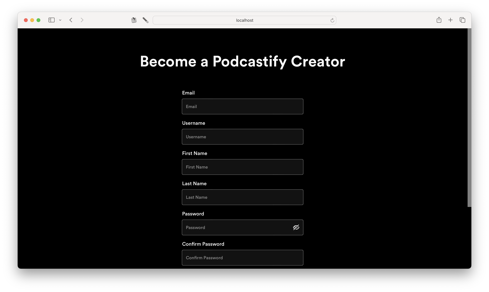
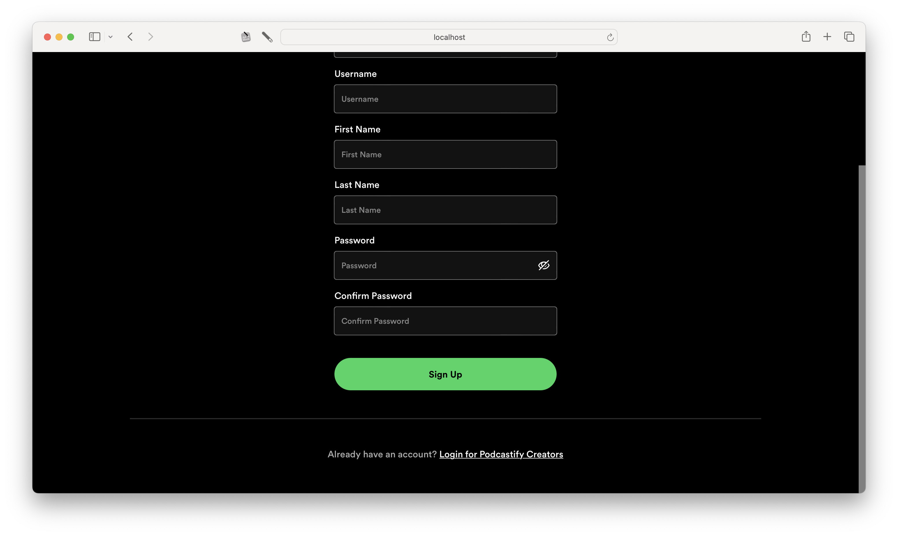
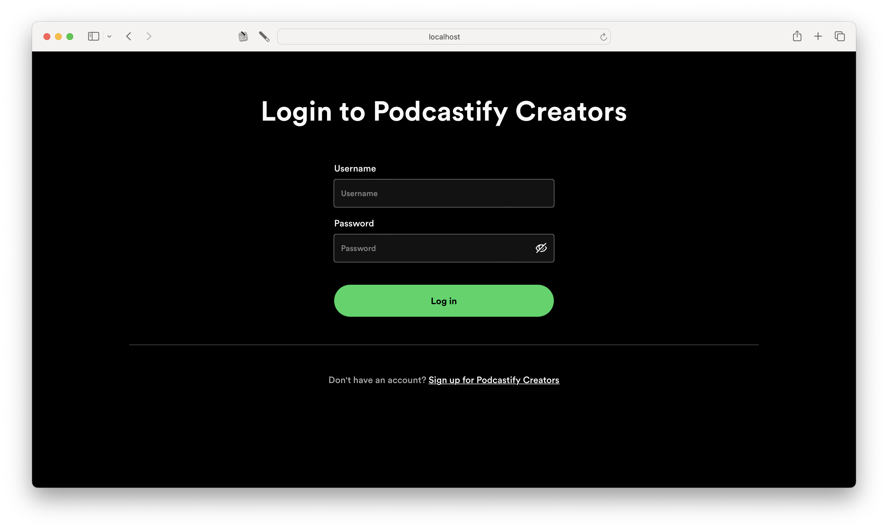
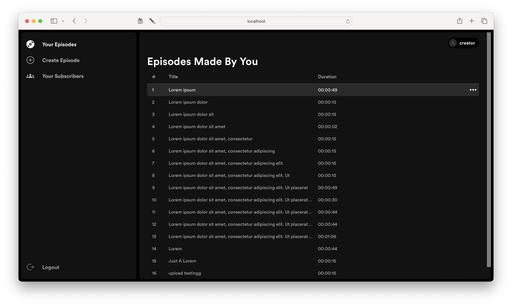
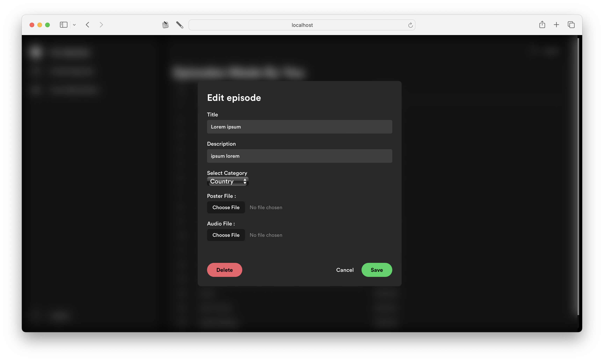
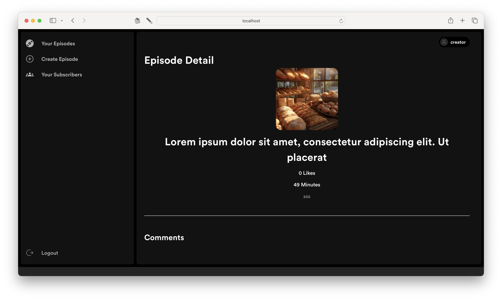
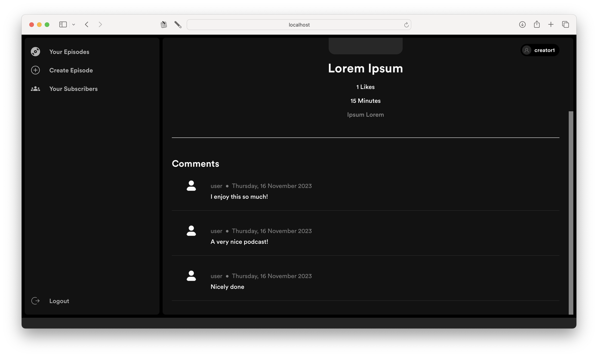
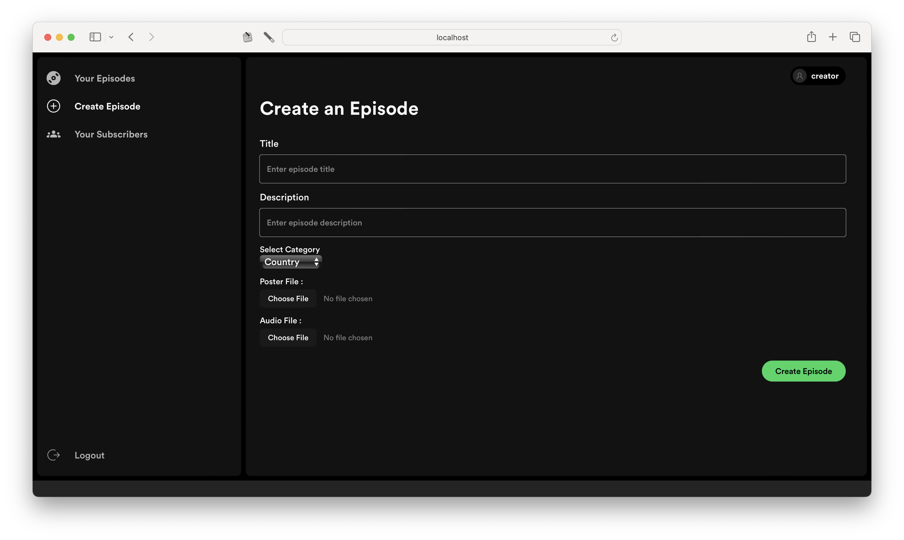
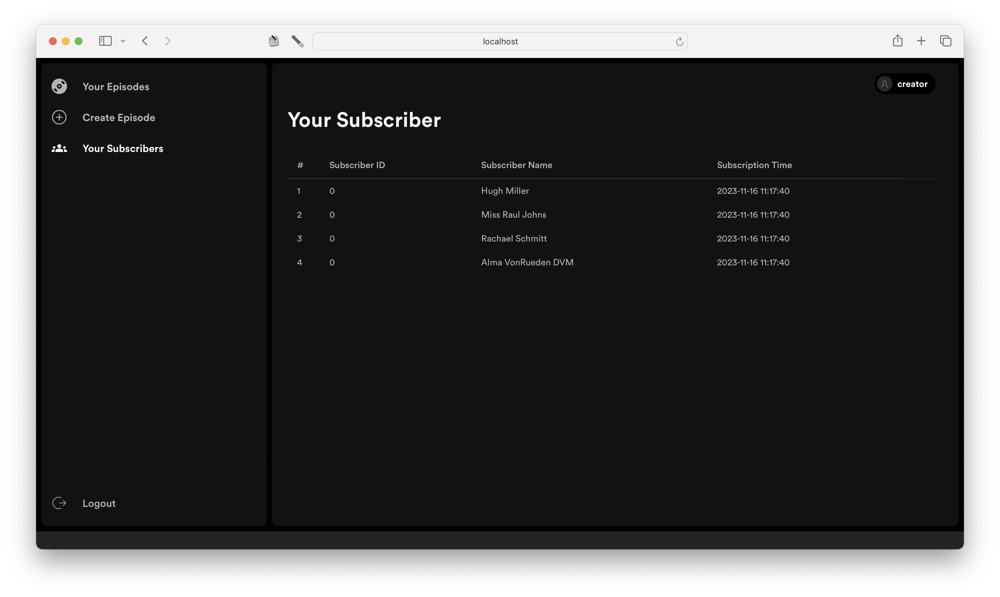
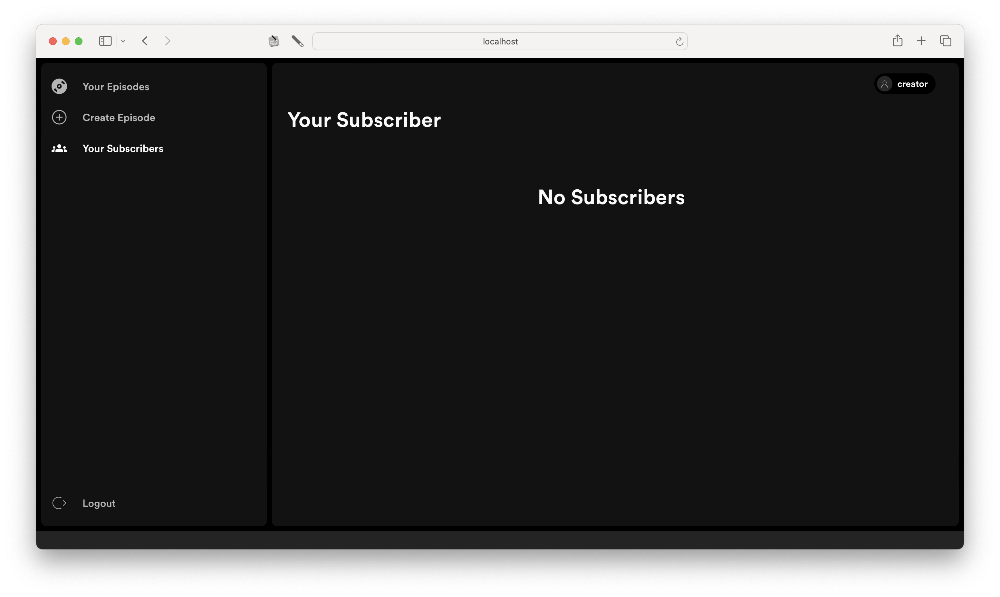
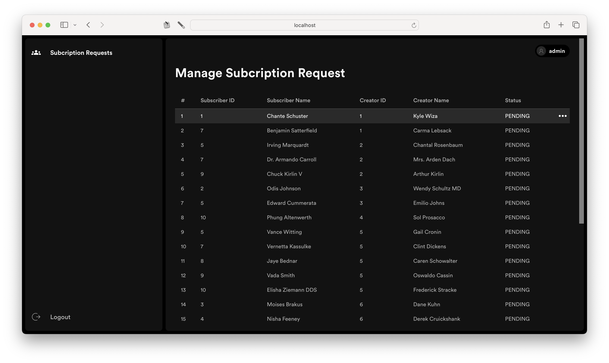
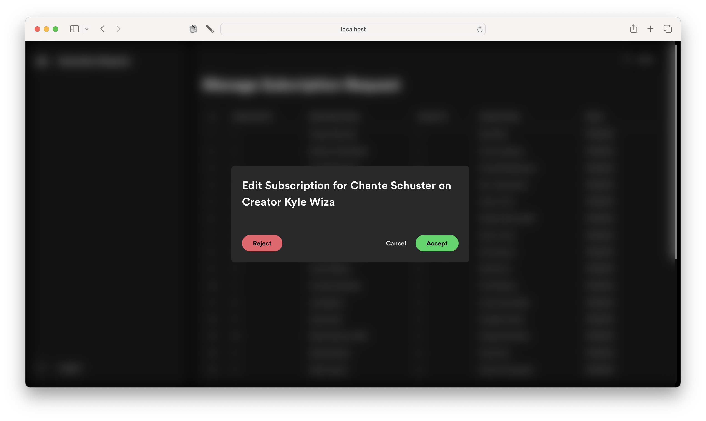
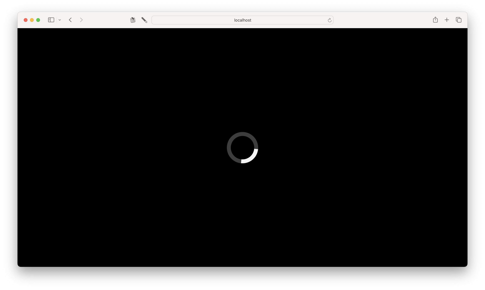

## User Functionality 
### Creator
1. See premium episodes by the creator
2. Create, update, and delete premium episodes
3. See subcribers
4. Register
5. Login and logout

### Admin
1. See pending subscriptions from Podcastify user
2. Accept pending subscriptions from Podcastify user
3. Reject pending subscriptions from Podcastify user
4. Login and logout

## Tech Stacks  
1. Docker
2. ReactJS (TypeScript)
3. Tailwind CSS
4. Vite
5. Axios
6. Redux

## How to Get Started
1. Clone this repository
2. Copy the `.env.example` file and rename it to `.env`:
```bash
    cp .env.example .env
```
3. Open the `.env` file and replace the placeholder values with your actual data.
4. On the root of this project, run the following commands:
```bash
    docker-compose up -d --build
```
5. To shut down the app, run
```bash
    docker-compose down
```
6. Ensure that the Docker Daemon is running

## Tasking
| 13521055                                   | 13521072                         | 13521102                            |
| :----------------------------------------- | :------------------------------- | :---------------------------------  |
| Setup Docker, API templates, and Structure | Episode List Page                | Admin Pending Subcription Page      |
| Modals                                     | Create Episode Page              | Creator List of Subscribers Page    |
| Notifications                              | Comment List                     | Subcription Manager API Integration |
| Lazy Loading                               | Sidebar UI                       |                                     |
| Authentication & Authorization Page and API Integration             | Topbar UI                        |                                     |
|                                            | Custom Hooks                     |                                     |
|                                            | Base Components                  |                                     |
|                                            | Episode CRUD and API Integration |                                     |
|                                            | Category API Integration         |                                     |

## Copyright
2023 © Podcastify. All Rights Reserved.
